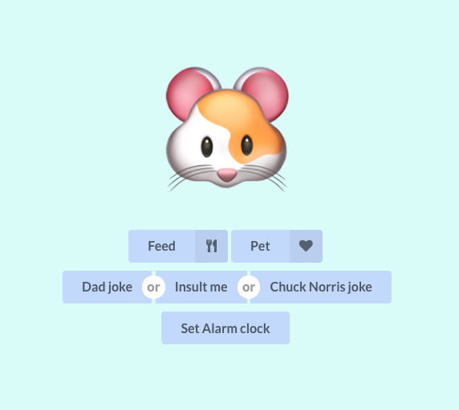

# Hacklarious
<p align="center">

</p>

Absolutely useless virtual pet. Interact with it, play with it.. it will never die (or will it?).

## Quick overview
This is a purely frontend project built with React. It interacts with a RESTful API to retrieve jokes, the alarm list and set a new alarm.

The project is deployed to Google Cloud Storage and can be accessed in our [very-unique domain](http://very-unique-domain-name.tech). Domain registered with [Domain.com](https://www.domain.com/). Internally the frontend uses Axios for making HTTP calls, Semantic UI for basic user-interface building blocks, moment.js for handling dates, and Animate.css and Framer for animations.

Our RESTful API stores the information in a [MongoDB](https://www.mongodb.com) database.


## Features

- Change your pet
- Feed your pet
- Pet your pet
- Interact with your pet for random fact (hover over it)
- Set an alarm clock
- Snooze the alarm clock once it pops open
- View various jokes


## Technologies used

General:
- [React](https://reactjs.org)
- [Create-react-app](https://create-react-app.dev)
- [EditorConfig](https://editorconfig.org)
- [Semantic UI](https://react.semantic-ui.com)
- [moment](https://momentjs.com)
- [axios](https://github.com/axios/axios)

Animations:
- [Animate.css](https://animate.style)
- [Framer](https://www.framer.com)

## Installing
```sh
yarn install
```

## Development
```sh
yarn start
```

## Production build
```sh
yarn build
```
